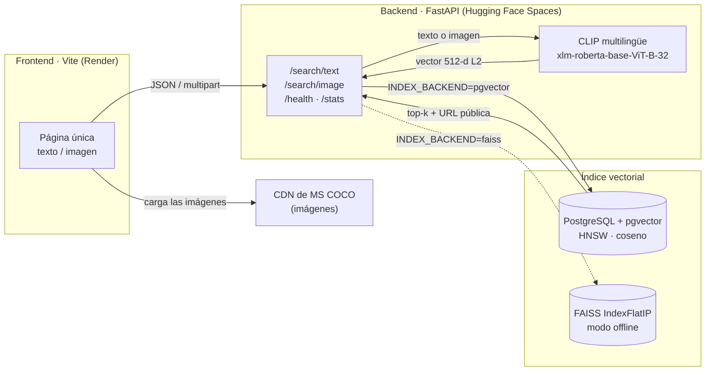

# 🔍 Buscador Multimodal de Imágenes

> Busca imágenes **describiéndolas en lenguaje natural** o **subiendo una foto parecida**.
> CLIP multilingüe genera los embeddings; PostgreSQL + pgvector (o FAISS en modo offline) hace la búsqueda por similitud coseno.

[](https://github.com/gcdavidq/Project_imagen_search_system/actions/workflows/ci.yml)


**Demo en vivo:** _pendiente de desplegar_ · **API:** _pendiente_ · Ver [Despliegue](#-despliegue).

<!-- Capturas: añadir docs/screenshot-text.png y docs/screenshot-image.png tras el despliegue -->

---

## ¿Qué hace?

| Modo | Entrada | Cómo funciona |
|------|---------|---------------|
| **Texto → Imagen** | `"un gato durmiendo en un sofá"` (español, inglés, …) | El texto se codifica con el encoder XLM-RoBERTa de CLIP y se buscan los vectores de imagen más cercanos. |
| **Imagen → Imagen** | Una foto (JPG/PNG/WebP, máx. 10 MB) | La imagen se codifica con el encoder ViT-B/32 y se buscan sus vecinas visuales. |

Ambas modalidades viven en el **mismo espacio vectorial de 512 dimensiones**, así que un único índice sirve para las dos búsquedas. El dataset es un subconjunto balanceado de **MS COCO 2017** (hasta 100 imágenes por cada una de las 80 categorías).

## Arquitectura



Decisiones de diseño que vale la pena conocer:

- **Las imágenes no se hospedan.** El script de descarga guarda la URL pública de cada imagen en el CDN de COCO y la API la devuelve en cada resultado. El backend solo almacena vectores, lo que hace el despliegue trivial. En desarrollo local, si no hay URL, se sirven desde `data/images/`.
- **Dos backends intercambiables** con una variable de entorno. `pgvector` para producción (búsqueda en SQL con índice HNSW); `faiss` para trabajar sin base de datos.
- **El modelo se carga una sola vez** en el `lifespan` de FastAPI. La inferencia y las consultas SQL corren en un threadpool para no bloquear el event loop.
- **Modo degradado:** si la base de datos no responde al arrancar, el servidor igual levanta y responde `503` en las búsquedas, con `/health` explicando qué falta.

## Estructura del repositorio

```text
.
├── backend/
│   ├── main.py            # App FastAPI: lifespan, CORS, /health, /stats
│   ├── embedder.py        # Carga de CLIP (open_clip) y generación de embeddings
│   ├── indexer.py         # Backends pgvector y FAISS: build, load, search, stats
│   ├── database.py        # Pool psycopg2 + esquema (extensión vector, tabla images)
│   ├── schemas.py         # Modelos Pydantic de peticiones y respuestas
│   ├── utils.py           # Configuración desde .env y helpers de imagen/formato
│   └── routes/
│       ├── text_search.py   # POST /search/text
│       └── image_search.py  # POST /search/image
├── frontend/
│   ├── index.html         # Página única con pestañas texto / imagen
│   ├── main.js            # Lógica: pestañas, /health, búsquedas, render
│   ├── style.css          # Estilos (paleta oscura, Inter + JetBrains Mono)
│   └── vite.config.js
├── scripts/
│   ├── download_coco.py   # Descarga el subset de COCO + metadata.json (categorías y URLs)
│   ├── build_index.py     # Genera embeddings y construye el índice (pgvector o FAISS)
│   └── search_cli.py      # Búsqueda por texto desde la terminal, sin servidor
├── tests/                 # pytest: API y utilidades (sin GPU ni base de datos)
├── Dockerfile             # Backend para Hugging Face Spaces / cualquier host Docker
├── render.yaml            # Blueprint de Render para el frontend estático
├── .github/workflows/ci.yml
├── requirements.txt · requirements-dev.txt · pyproject.toml
└── .env.example
```

## Stack

| Capa | Tecnologías |
|------|-------------|
| Backend | Python 3.10+ · FastAPI · Uvicorn · Pydantic |
| ML | [open_clip](https://github.com/mlfoundations/open_clip) · PyTorch (CPU) · modelo `xlm-roberta-base-ViT-B-32` / `laion5b_s13b_b90k` |
| Vectores | PostgreSQL 14+ con [pgvector](https://github.com/pgvector/pgvector) (HNSW) · psycopg2 · FAISS (offline) |
| Frontend | HTML + CSS + JavaScript vanilla · Vite 8 |
| Datos | MS COCO 2017 (subset) |
| Calidad | pytest · ruff · GitHub Actions |

---

## 🚀 Ejecución local

### Requisitos

| Requisito | Versión | Notas |
|-----------|---------|-------|
| Python | 3.10 – 3.13 | |
| Node.js | 18+ | Solo para el frontend |
| PostgreSQL + pgvector | 14+ | **Opcional**: usa `INDEX_BACKEND=faiss` para no necesitarlo. [Supabase](https://supabase.com) lo ofrece gratis. |
| Disco | ~4 GB | PyTorch CPU (~800 MB) + modelo (~1 GB) + imágenes (~1.5 GB con 100/categoría) |
| RAM | 4 GB+ | El modelo multilingüe ocupa ~1.5 GB en memoria |

### 1. Backend

```bash
# Desde la raíz del repositorio
python -m venv .venv
.venv\Scripts\activate            # Windows
# source .venv/bin/activate       # Linux / macOS

pip install -r requirements.txt   # en Linux, para evitar CUDA:
                                  # pip install torch torchvision --index-url https://download.pytorch.org/whl/cpu
                                  # y luego pip install -r requirements.txt

cp .env.example .env              # y edita los valores (ver tabla más abajo)
```

**Opción A · sin base de datos (FAISS, más rápido de probar):** en `.env` pon `INDEX_BACKEND=faiss` y salta al paso 2.

**Opción B · PostgreSQL / Supabase:** crea un proyecto en Supabase, copia la *connection string* de *Project Settings → Database* en `DATABASE_URL` y deja `INDEX_BACKEND=pgvector`. La extensión `vector` y la tabla se crean solas al arrancar.

### 2. Dataset e índice

```bash
# Descarga el subset de COCO (100 imgs/categoría ≈ 6-8 k imágenes, varios minutos).
# --split val es mucho más ligero (≈ 3 k imágenes) si solo quieres probar.
python scripts/download_coco.py            # o: --split val --images-per-cat 40

# Genera los embeddings y construye el índice en el backend configurado.
python scripts/build_index.py              # o: --backend faiss  /  --limit 500
```

### 3. Servidor y frontend

```bash
uvicorn backend.main:app --reload --port 8000
# → http://localhost:8000/docs  (OpenAPI)   ·   http://localhost:8000/health
```

En otra terminal:

```bash
cd frontend
npm install
npm run dev
# → http://localhost:5173
```

El frontend apunta por defecto a `http://localhost:8000`. Para cambiarlo copia `frontend/.env.example` a `frontend/.env` y ajusta `VITE_API_URL`.

### Búsqueda desde la terminal (sin servidor)

```bash
python scripts/search_cli.py               # o: --backend faiss --top-k 10
```

---

## ⚙️ Variables de entorno (`.env`)

| Variable | Descripción | Por defecto |
|----------|-------------|-------------|
| `INDEX_BACKEND` | `pgvector` o `faiss` | `pgvector` |
| `DATABASE_URL` | Cadena de conexión PostgreSQL (Supabase la entrega lista) | — |
| `DB_HOST` `DB_PORT` `DB_NAME` `DB_USER` `DB_PASSWORD` | Alternativa a `DATABASE_URL` | `5432` / `postgres` / `postgres` |
| `MODEL_NAME` / `PRETRAINED` | Modelo CLIP (nomenclatura open_clip). Cambiarlo implica reconstruir el índice | `xlm-roberta-base-ViT-B-32` / `laion5b_s13b_b90k` |
| `DATA_DIR` | Carpeta de imágenes, metadatos e índice FAISS | `<raíz>/data` |
| `TOP_K_DEFAULT` | Resultados por defecto (máx. 50) | `6` |
| `CORS_ORIGINS` | Orígenes permitidos, separados por coma | `*` |

> `.env` está en `.gitignore`. Nunca subas credenciales al repositorio.

## 🗄️ Esquema de base de datos

Creado automáticamente por `init_db()` al arrancar el backend o al indexar:

```sql
CREATE EXTENSION IF NOT EXISTS vector;

CREATE TABLE IF NOT EXISTS images (
    id          SERIAL PRIMARY KEY,
    image_path  TEXT UNIQUE NOT NULL,   -- ruta relativa a data/images/
    image_url   TEXT,                   -- URL pública (CDN de COCO); NULL → se sirve localmente
    categories  JSONB,                  -- ["cat", "couch"]
    embedding   VECTOR(512)             -- embedding CLIP normalizado L2
);

CREATE INDEX IF NOT EXISTS images_embedding_hnsw_idx
    ON images USING hnsw (embedding vector_cosine_ops);
```

Consulta de búsqueda (el operador `<=>` es la distancia coseno):

```sql
SELECT image_path, image_url, categories, 1 - (embedding <=> %s) AS similarity
FROM images
ORDER BY embedding <=> %s
LIMIT %s;
```

## 🔌 API

Documentación interactiva en `/docs`. Resumen:

| Método | Ruta | Descripción |
|--------|------|-------------|
| `POST` | `/search/text` | JSON `{"query": "...", "top_k": 6}` → resultados |
| `POST` | `/search/image` | `multipart/form-data` con `file` (imagen) y `top_k` opcional |
| `GET` | `/health` | Estado del modelo y del índice |
| `GET` | `/stats` | Total de imágenes y conteo por categoría |

Respuesta de búsqueda:

```json
{
  "results": [
    {
      "image_url": "https://images.cocodataset.org/train2017/000000000009.jpg",
      "score": 0.3121,
      "categories": ["bowl", "broccoli", "orange"]
    }
  ],
  "count": 6,
  "took_ms": 38.4
}
```

> `score` es la similitud coseno cruda de CLIP. Para este modelo, valores de 0.25 a 0.35 ya indican coincidencias muy buenas; el frontend lo muestra como porcentaje recortado a `[0, 1]`.

Errores: `400` entrada inválida (consulta vacía, archivo corrupto o > 10 MB), `422` validación de esquema, `503` índice no disponible.

---

## ☁️ Despliegue

Tres piezas, todas en planes gratuitos:

| Pieza | Plataforma | Por qué |
|-------|-----------|---------|
| Base de datos | **Supabase** | PostgreSQL gestionado con pgvector incluido. 8 k vectores ≈ 16 MB. |
| Backend | **Hugging Face Spaces (Docker)** | 16 GB de RAM y 2 vCPU gratis; el backend necesita ~2 GB para PyTorch + CLIP, más de lo que ofrecen los planes gratuitos de Render/Railway. |
| Frontend | **Render (static site)** | Build de Vite y CDN. Definido en `render.yaml`. |

### 1. Supabase

1. Crea un proyecto en [supabase.com](https://supabase.com).
2. En *Project Settings → Database → Connection string* copia la URI (modo **Session** para la indexación).
3. Desde tu máquina, con esa URI en `DATABASE_URL` y `INDEX_BACKEND=pgvector`, ejecuta los pasos de [Dataset e índice](#2-dataset-e-índice). La tabla, la extensión y el índice HNSW se crean solos.

### 2. Backend en Hugging Face Spaces

1. Crea un Space en [huggingface.co/new-space](https://huggingface.co/new-space) con **SDK: Docker**, hardware **CPU basic (gratis)**.
2. Sube el contenido del repositorio al Space (o conéctalo a GitHub). El `Dockerfile` de la raíz ya expone el puerto `7860` y pre-descarga el modelo en el build.
3. En *Settings → Variables and secrets* define:
   - `DATABASE_URL` (secret) → la URI de Supabase, modo **Transaction pooler** (puerto 6543) es el recomendado para servidores.
   - `INDEX_BACKEND=pgvector`
   - `CORS_ORIGINS` → la URL de tu frontend en Render (o `*` mientras pruebas).
4. La primera build tarda ~10 min (descarga PyTorch y el modelo). Verifica `https://<usuario>-<space>.hf.space/health`.

> Los Spaces gratuitos se duermen tras 48 h sin uso y tardan 1-2 min en despertar (carga del modelo en CPU). El frontend lo detecta y muestra "Despertando el servidor…". La primera búsqueda tras el arranque es más lenta (calentamiento de PyTorch); las siguientes tardan unos cientos de milisegundos.

### 3. Frontend en Render

1. En [dashboard.render.com](https://dashboard.render.com) → *New → Blueprint* → selecciona el repositorio. Render lee `render.yaml`.
2. Cuando lo pida, define la variable `VITE_API_URL` con la URL pública del Space (sin barra final).
3. Deploy. Actualiza después `CORS_ORIGINS` en el Space con la URL que te asigne Render.

### Docker local (opcional)

```bash
docker build -t image-search-backend .
docker run --rm -p 7860:7860 --env-file .env -v "$PWD/data:/app/data" image-search-backend
```

---

## 🧪 Calidad

```bash
pip install -r requirements-dev.txt
ruff check .        # lint + orden de imports
pytest              # 22 pruebas, corren en segundos sin GPU ni base de datos
```

Las pruebas sustituyen el embedder y el indexador por dobles deterministas, así que validan la API (validación de entradas, formateo, modo degradado) sin depender de PyTorch ni de PostgreSQL. GitHub Actions ejecuta lint, pruebas y el build del frontend en cada push.

## 🛠️ Solución de problemas

| Síntoma | Causa probable | Solución |
|---------|----------------|----------|
| `/health` → `index_loaded: false` | No hay conexión a la BD o no existe el índice FAISS | Revisa `DATABASE_URL` / ejecuta `build_index.py` y reinicia |
| `503` en las búsquedas | Ídem | Ídem |
| Resultados sin sentido | Índice construido con un modelo distinto al configurado | Reconstruye con `build_index.py` |
| `ModuleNotFoundError: backend` | Uvicorn o los scripts no se ejecutan desde la raíz | Ejecuta todo desde la raíz del repositorio |
| Instalación de torch enorme en Linux | Se descargaron las ruedas CUDA | Instala torch desde `https://download.pytorch.org/whl/cpu` primero |
| CORS en el navegador | `CORS_ORIGINS` no incluye el origen del frontend | Ajusta la variable en el backend |

## Roadmap

- [ ] Lightbox al hacer clic en un resultado y "buscar similares" desde la propia tarjeta.
- [ ] Sección "cómo funciona" con el pipeline animado y el tiempo real de cada etapa.
- [ ] Filtro por categoría en la búsqueda.

## Licencia

MIT. El dataset MS COCO tiene su propia [licencia](https://cocodataset.org/#termsofuse); las imágenes se enlazan desde su CDN y no se redistribuyen.
