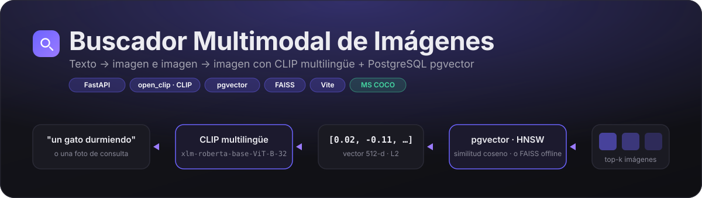

<div align="center">



<br/>

[](https://github.com/gcdavidq/Project_imagen_search_system/actions/workflows/ci.yml)
[](https://www.python.org/)
[](https://fastapi.tiangolo.com/)
[](https://github.com/pgvector/pgvector)
[](https://vite.dev/)
[](LICENSE)

**Escribe "un gato durmiendo en un sofá" o sube una foto. Recibe las imágenes más parecidas de MS COCO en milisegundos.**

[🚀 Demo en vivo](#-demo) · [⚡ Inicio rápido](#-inicio-rápido) · [🧠 Cómo funciona](#-cómo-funciona) · [🔌 API](#-api) · [☁️ Despliegue](#%EF%B8%8F-despliegue)

</div>

---

## ✨ ¿Qué hace?

<table>
<tr>
<td width="50%" valign="top">

### 📝 Texto → Imagen
Describe una escena en **español, inglés o cualquiera de los 100+ idiomas** que entiende el encoder XLM-RoBERTa. El texto se convierte en un vector y se buscan las imágenes cuyo vector está más cerca.

```
"pizza sobre una mesa de madera"
"a red sports car"
"personas surfeando en el mar"
```

</td>
<td width="50%" valign="top">

### 🖼️ Imagen → Imagen
Arrastra, elige o **pega desde el portapapeles** una foto. El encoder visual ViT-B/32 la codifica al mismo espacio y devuelve sus vecinas visuales.

```
JPG · PNG · WebP · BMP
hasta 10 MB · sin registro
```

</td>
</tr>
</table>

Ambas modalidades viven en el **mismo espacio vectorial de 512 dimensiones**: un único índice sirve para las dos búsquedas. El catálogo es un subconjunto balanceado de **MS COCO 2017** (hasta 100 imágenes por cada una de sus 80 categorías).

## 🎬 Demo

> **Demo en vivo:** _pendiente de desplegar_ · **API:** _pendiente_
>
> <sub>Guía paso a paso de todo lo que falta, con comandos y verificaciones: [docs/PASOS_PENDIENTES.md](docs/PASOS_PENDIENTES.md).</sub>

<!--
Cuando tengas el demo desplegado, graba un GIF corto (p. ej. con ScreenToGif) y colócalo aquí:
<p align="center"></p>
-->

| | |
|---|---|
| **Interfaz** | Página única con pestañas texto / imagen, estados de carga, vacío y error, resultados con porcentaje de similitud y categorías COCO. |
| **Estado del servidor** | El frontend consulta `/health` y muestra "Despertando el servidor…" durante el arranque en frío del contenedor, en lugar de fallar. |
| **Sin registro, sin tracking** | No se guarda nada de lo que buscas ni de las imágenes que subes. |

## ⚡ Inicio rápido

La forma más rápida de verlo funcionar, **sin base de datos**, usando el modo FAISS:

```bash
git clone https://github.com/gcdavidq/Project_imagen_search_system.git
cd Project_imagen_search_system

python -m venv .venv && .venv\Scripts\activate       # Windows  (Linux/macOS: source .venv/bin/activate)
pip install -r requirements.txt

cp .env.example .env
# en .env:  INDEX_BACKEND=faiss

python scripts/download_coco.py --split val --images-per-cat 30   # ≈ 2 000 imágenes, unos minutos
python scripts/build_index.py                                     # genera embeddings y el índice
uvicorn backend.main:app --reload --port 8000                     # → http://localhost:8000/docs
```

En otra terminal:

```bash
cd frontend && npm install && npm run dev                         # → http://localhost:5173
```

> 💡 En Linux instala PyTorch CPU primero para evitar descargar las ruedas CUDA de varios GB:
> `pip install torch torchvision --index-url https://download.pytorch.org/whl/cpu`

<details>
<summary><b>Requisitos</b></summary>

| Requisito | Versión | Notas |
|-----------|---------|-------|
| Python | 3.10 – 3.13 | |
| Node.js | 18+ | Solo para el frontend |
| PostgreSQL + pgvector | 14+ | **Opcional.** `INDEX_BACKEND=faiss` no lo necesita. [Neon](https://neon.tech) lo ofrece gratis. |
| Disco | ~4 GB | PyTorch CPU (~800 MB) + modelo (~1 GB) + imágenes (~1.5 GB con 100/categoría) |
| RAM | 4 GB+ | El modelo multilingüe ocupa ~1.5 GB en memoria |

</details>

<details>
<summary><b>Usar PostgreSQL en lugar de FAISS</b></summary>

Sirve cualquier PostgreSQL con la extensión `pgvector`: [Neon](https://neon.tech), [Supabase](https://supabase.com), Railway o uno local en Docker.

1. Crea una base de datos y copia su cadena de conexión.
2. En `.env`: `INDEX_BACKEND=pgvector` y `DATABASE_URL=postgresql://...`.
3. Ejecuta `python scripts/build_index.py`. La extensión `vector`, la tabla `images` y el índice HNSW se crean solos.

> Probado con **Neon** (PostgreSQL 18, pgvector 0.8): sin configuración adicional más allá de la cadena de conexión.

</details>

<details>
<summary><b>Búsqueda desde la terminal, sin servidor</b></summary>

```bash
python scripts/search_cli.py               # o: --backend faiss --top-k 10
```

```
Consulta > un perro corriendo en la playa
 1. 0.3124  coco_000000123456.jpg  [dog, person]
 2. 0.2987  coco_000000234567.jpg  [dog, frisbee]
 ...
```

</details>

## 🧠 Cómo funciona


1. **Indexación (una vez).** `build_index.py` pasa cada imagen por el encoder visual de CLIP, normaliza el vector (L2) y lo guarda en PostgreSQL junto con sus categorías y la URL pública de la imagen.
2. **Consulta.** El texto o la imagen de consulta se codifica con CLIP al mismo espacio de 512 dimensiones.
3. **Búsqueda.** pgvector calcula la distancia coseno con el operador `<=>` y devuelve los *k* vecinos más cercanos usando un índice HNSW (búsqueda aproximada, sub-milisegundo a escala de miles de vectores).
4. **Respuesta.** La API devuelve URLs, similitud y categorías; el frontend pinta las tarjetas.

> 🗂️ **¿Dónde se guardan las imágenes?** En ningún servidor propio. La base de datos guarda el vector y **la URL pública** de cada foto en el CDN de MS COCO, y el navegador la descarga directamente de ahí. El backend nunca sirve bytes de imagen: ni almacenamiento de objetos, ni ancho de banda, ni coste. La carpeta `data/images/` solo existe en la máquina donde se calculan los embeddings. La imagen que sube el usuario para buscar tampoco se guarda: se procesa en memoria y se descarta.

<details>
<summary><b>Decisiones de diseño</b></summary>

- **Las imágenes no se hospedan.** El script de descarga guarda la URL de cada imagen en el CDN de COCO y la API la devuelve en cada resultado. El backend solo almacena vectores (8 000 × 512 floats ≈ 16 MB), lo que hace el despliegue trivial. En local, si no hay URL, se sirven desde `data/images/`.
- **Dos backends intercambiables** con una variable de entorno. `pgvector` para producción; `faiss` para trabajar sin base de datos o sin conexión. Ambos devuelven exactamente el mismo contrato.
- **El modelo se carga una sola vez** en el `lifespan` de FastAPI. Inferencia y consultas SQL corren en un threadpool para no bloquear el event loop.
- **Modo degradado.** Si la base de datos no responde al arrancar, el servidor levanta igual y responde `503` en las búsquedas, con `/health` explicando qué falta.
- **Modelo multilingüe** (`laion5b_s13b_b90k`): consultas en español sin traducir. Cuesta ~1 GB y un arranque más lento que `ViT-B-32/openai`, pero el demo se entiende en el idioma del usuario.

</details>

<details>
<summary><b>Esquema de base de datos</b></summary>

```sql
CREATE EXTENSION IF NOT EXISTS vector;

CREATE TABLE IF NOT EXISTS images (
    id          SERIAL PRIMARY KEY,
    image_path  TEXT UNIQUE NOT NULL,   -- ruta relativa a data/images/
    image_url   TEXT,                   -- URL pública (CDN de COCO); NULL → se sirve localmente
    categories  JSONB,                  -- ["cat", "couch"]
    embedding   VECTOR(512)             -- embedding CLIP normalizado L2
);

CREATE INDEX IF NOT EXISTS images_embedding_hnsw_idx
    ON images USING hnsw (embedding vector_cosine_ops);

-- Búsqueda: <=> es la distancia coseno
SELECT image_path, image_url, categories, 1 - (embedding <=> %s) AS similarity
FROM images
ORDER BY embedding <=> %s
LIMIT %s;
```

</details>

## 🔌 API

Documentación interactiva (Swagger) en `/docs`.

| Método | Ruta | Descripción |
|:------:|------|-------------|
| `POST` | `/search/text` | `{"query": "...", "top_k": 6}` → resultados |
| `POST` | `/search/image` | `multipart/form-data` con `file` y `top_k` opcional |
| `GET` | `/health` | Estado del modelo y del índice |
| `GET` | `/stats` | Total de imágenes y conteo por categoría |

<details>
<summary><b>Ejemplo de respuesta</b></summary>

```json
{
  "results": [
    {
      "image_url": "https://images.cocodataset.org/train2017/000000000009.jpg",
      "score": 0.3121,
      "categories": ["bowl", "broccoli", "orange"]
    }
  ],
  "count": 6,
  "took_ms": 38.4
}
```

`score` es la similitud coseno cruda de CLIP. Para este modelo, valores de **0.25 a 0.35** ya son coincidencias muy buenas; el frontend lo muestra como porcentaje.

Errores: `400` entrada inválida (consulta vacía, archivo corrupto o > 10 MB) · `422` validación de esquema · `503` índice no disponible.

</details>

## 🧰 Stack

| Capa | Tecnologías |
|------|-------------|
| **Backend** | Python · FastAPI · Uvicorn · Pydantic |
| **ML** | [open_clip](https://github.com/mlfoundations/open_clip) · PyTorch (CPU) · `xlm-roberta-base-ViT-B-32` / `laion5b_s13b_b90k` |
| **Vectores** | PostgreSQL + [pgvector](https://github.com/pgvector/pgvector) (HNSW) · psycopg2 · FAISS |
| **Frontend** | HTML + CSS + JavaScript vanilla · Vite 8 |
| **Datos** | [MS COCO 2017](https://cocodataset.org) |
| **Calidad** | pytest · ruff · GitHub Actions · Docker |

<details>
<summary><b>Estructura del repositorio</b></summary>

```text
.
├── backend/
│   ├── main.py            # App FastAPI: lifespan, CORS, /health, /stats
│   ├── embedder.py        # Carga de CLIP (open_clip) y generación de embeddings
│   ├── indexer.py         # Backends pgvector y FAISS: build, load, search, stats
│   ├── database.py        # Pool psycopg2 + esquema (extensión vector, tabla images)
│   ├── schemas.py         # Modelos Pydantic de peticiones y respuestas
│   ├── utils.py           # Configuración desde .env y helpers de imagen/formato
│   └── routes/
│       ├── text_search.py   # POST /search/text
│       └── image_search.py  # POST /search/image
├── frontend/
│   ├── index.html         # Página única con pestañas texto / imagen
│   ├── main.js            # Pestañas, /health, búsquedas, render
│   ├── style.css          # Paleta oscura, Inter + JetBrains Mono
│   └── vite.config.js
├── scripts/
│   ├── download_coco.py   # Subset de COCO + metadata.json (categorías y URLs)
│   ├── build_index.py     # Embeddings + índice (pgvector o FAISS)
│   └── search_cli.py      # Búsqueda desde la terminal, sin servidor
├── tests/                 # pytest: API y utilidades (sin GPU ni base de datos)
├── docs/                  # Banner y capturas
├── Dockerfile             # Backend para Cloud Run o cualquier host que inyecte $PORT
├── render.yaml            # Blueprint de Render para el frontend estático
├── .github/workflows/ci.yml
└── .env.example · requirements.txt · requirements-dev.txt · pyproject.toml
```

</details>

<details>
<summary><b>Variables de entorno</b></summary>

| Variable | Descripción | Por defecto |
|----------|-------------|-------------|
| `INDEX_BACKEND` | `pgvector` o `faiss` | `pgvector` |
| `DATABASE_URL` | Cadena de conexión PostgreSQL (Neon o Supabase la entregan lista) | — |
| `DB_HOST` `DB_PORT` `DB_NAME` `DB_USER` `DB_PASSWORD` | Alternativa a `DATABASE_URL` | `5432` / `postgres` / `postgres` |
| `MODEL_NAME` / `PRETRAINED` | Modelo CLIP (nomenclatura open_clip). Cambiarlo implica reconstruir el índice | `xlm-roberta-base-ViT-B-32` / `laion5b_s13b_b90k` |
| `DATA_DIR` | Carpeta de imágenes, metadatos e índice FAISS | `<raíz>/data` |
| `TOP_K_DEFAULT` | Resultados por defecto (máx. 50) | `6` |
| `CORS_ORIGINS` | Orígenes permitidos, separados por coma | `*` |
| `VITE_API_URL` | *(frontend)* URL pública del backend | `http://localhost:8000` |

`.env` está en `.gitignore`. Nunca subas credenciales al repositorio.

</details>

## ☁️ Despliegue

Tres piezas, todas en **planes gratuitos**:

| Pieza | Plataforma | Por qué |
|-------|-----------|---------|
| 🗄️ Base de datos | **Neon** | PostgreSQL serverless con pgvector incluido. 8 k vectores ≈ 16 MB. Se duerme sin uso y despierta en menos de un segundo. |
| 🧠 Backend | **Google Cloud Run** | Ejecuta el `Dockerfile` sin cambios con 4 GiB de RAM y escala a cero. El backend usa 2,2 GB en régimen y 3,2 GB de pico al cargar el modelo, muy por encima de los 512 MB de los planes gratuitos de Render, Koyeb o Fly. |
| 🖥️ Frontend | **Render (static site)** | Build de Vite y CDN, definido en `render.yaml`. |

<details>
<summary><b>1 · Base de datos en Neon</b></summary>

1. Crea un proyecto en [neon.tech](https://neon.tech) (plan Free).
2. En **Connect** copia la cadena de conexión del endpoint **`-pooler`**.
3. En tu máquina, con esa URI en `DATABASE_URL` y `INDEX_BACKEND=pgvector`, ejecuta `download_coco.py` y `build_index.py`. La extensión `vector`, la tabla `images` y el índice HNSW se crean solos.

La misma cadena sirve para indexar desde tu PC y para el backend en producción.

</details>

<details>
<summary><b>2 · Backend en Google Cloud Run</b></summary>

El `Dockerfile` de la raíz sirve sin cambios: escucha en `$PORT` y **pre-descarga el modelo y el tokenizador durante el build**, así el contenedor arranca sin acceder a internet.

```bash
# Guarda la cadena de Neon como secreto (se pega por stdin, no queda en el historial)
gcloud secrets create image-search-db --data-file=-

gcloud run deploy image-search   --source . --region southamerica-east1   --memory 4Gi --cpu 2 --cpu-boost   --concurrency 4 --max-instances 2 --min-instances 0   --allow-unauthenticated   --set-env-vars INDEX_BACKEND=pgvector,CORS_ORIGINS=*   --set-secrets DATABASE_URL=image-search-db:latest
```

Verifica `https://image-search-xxxxx.run.app/health`. Los pasos completos, con la configuración de la cuenta y el control de gasto, están en [docs/PASOS_PENDIENTES.md](docs/PASOS_PENDIENTES.md).

Cloud Run **escala a cero**: sin tráfico no hay contenedor ni consumo. El primer acceso tras un rato de inactividad arranca uno nuevo, que tarda unos 60 s en cargar el modelo; el frontend lo detecta y muestra "Despertando el servidor…".

</details>

<details>
<summary><b>3 · Frontend en Render</b></summary>

1. En [dashboard.render.com](https://dashboard.render.com) → *New → Blueprint* → selecciona el repositorio. Render lee `render.yaml`.
2. Define `VITE_API_URL` con la URL pública de Cloud Run (sin barra final).
3. Deploy. Después, actualiza `CORS_ORIGINS` en Cloud Run con la URL que te asigne Render.

</details>

<details>
<summary><b>Docker local</b></summary>

```bash
docker build -t image-search-backend .
docker run --rm -p 7860:7860 --env-file .env -v "$PWD/data:/app/data" image-search-backend
```

</details>

## 🧪 Calidad

```bash
pip install -r requirements-dev.txt
ruff check .        # lint + orden de imports
pytest              # 22 pruebas en ~3 s, sin GPU ni base de datos
```

Las pruebas sustituyen el embedder y el indexador por dobles deterministas: validan la API (validación de entradas, formateo, modo degradado) sin PyTorch ni PostgreSQL. GitHub Actions ejecuta lint, pruebas y el build del frontend en cada push.

<details>
<summary><b>Solución de problemas</b></summary>

| Síntoma | Causa probable | Solución |
|---------|----------------|----------|
| `/health` → `index_loaded: false` | Sin conexión a la BD o no existe el índice FAISS | Revisa `DATABASE_URL` / ejecuta `build_index.py` y reinicia |
| `503` en las búsquedas | Ídem | Ídem |
| Resultados sin sentido | Índice construido con un modelo distinto al configurado | Reconstruye con `build_index.py` |
| `ModuleNotFoundError: backend` | Uvicorn o los scripts no se ejecutan desde la raíz | Ejecuta todo desde la raíz del repositorio |
| Instalación de torch enorme en Linux | Se descargaron las ruedas CUDA | Instala torch desde `https://download.pytorch.org/whl/cpu` primero |
| Error CORS en el navegador | `CORS_ORIGINS` no incluye el origen del frontend | Ajusta la variable en el backend |

</details>

## 🗺️ Roadmap

- [ ] Lightbox al hacer clic en un resultado y "buscar similares" desde la propia tarjeta.
- [ ] Sección "cómo funciona" animada dentro del frontend, con el tiempo real de cada etapa.
- [ ] Filtro por categoría en la búsqueda.
- [ ] Capturas y GIF del demo desplegado.

## 📄 Licencia

[MIT](LICENSE). Las imágenes de MS COCO tienen su propia [licencia](https://cocodataset.org/#termsofuse); se enlazan desde su CDN y no se redistribuyen.

<div align="center">
<sub>Hecho con CLIP, PostgreSQL y bastante café · <a href="https://github.com/gcdavidq">@gcdavidq</a></sub>
</div>
