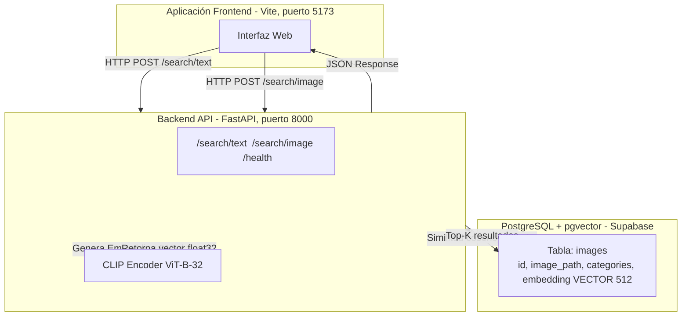

# 🔍 Sistema Multimodal de Búsqueda de Imágenes

Sistema de búsqueda **texto → imagen** e **imagen → imagen** usando **CLIP (ViT-B-32)** para la generación de embeddings y **PostgreSQL con pgvector** para búsqueda vectorial eficiente mediante similitud coseno.

Cuenta con una **arquitectura desacoplada**: backend en **FastAPI** y frontend moderno e independiente empaquetado con **Vite**.

| Modo | Endpoint | Entrada | Salida |
|------|----------|---------|--------|
| Texto → Imagen | `POST /search/text` | Descripción de texto (`"a sleeping cat"`) | Imágenes más relevantes |
| Imagen → Imagen | `POST /search/image` | Imagen de consulta (JPG/PNG/WebP, máx. 10 MB) | Imágenes visualmente similares |

---

## 🏗️ Arquitectura Desacoplada



> CLIP proyecta texto e imágenes al **mismo espacio vectorial de 512 dimensiones**, por lo que ambas modalidades de consulta operan sobre el mismo índice en la base de datos. La similitud coseno se calcula directamente en PostgreSQL mediante el operador `<=>` de `pgvector`.

---

## 📁 Estructura del Proyecto

```text
image_search_system/
├── backend/
│   ├── __init__.py
│   ├── main.py            # App FastAPI: lifespan, CORS, montaje de imágenes estáticas
│   ├── embedder.py        # Integración con CLIP via open-clip-torch (ViT-B-32/openai)
│   ├── indexer.py         # Lógica de indexado: PostgreSQL (pgvector) + fallback FAISS
│   ├── database.py        # Conexión psycopg2, init_db(), execute_query()
│   ├── utils.py           # Config desde .env, helpers de imagen y formateo de respuestas
│   └── routes/
│       ├── text_search.py   # POST /search/text (Text-to-Image)
│       └── image_search.py  # POST /search/image (Image-to-Image)
├── frontend/
│   ├── index.html           # Búsqueda por texto
│   ├── image-search.html    # Búsqueda por imagen
│   ├── main.js              # Lógica JavaScript del frontend
│   ├── style.css            # Estilos
│   └── package.json         # Dependencias (Vite ^8.1.0)
├── data/
│   ├── images/              # Imágenes del dataset (MS COCO subset)
│   └── embeddings/          # Archivos locales de índice FAISS (modo opcional)
├── scripts/
│   ├── download_coco.py     # Descarga optimizada del dataset MS COCO (100 imgs/categoría)
│   ├── build_index.py       # Genera embeddings e inserta en PostgreSQL (o FAISS)
│   ├── standalone_embedder.py  # Pruebas y visualización de embeddings
│   └── test_similarity.py   # Pruebas de búsqueda por similitud coseno
├── requirements.txt         # Dependencias Python
├── .env.example             # Plantilla de variables de entorno
└── README.md                # Este archivo
```

---

## ✅ Requisitos Previos

| Requisito | Versión mínima | Notas |
|-----------|----------------|-------|
| Python | 3.10+ | Requerido por FastAPI y open-clip |
| Node.js | 18+ | Para el frontend con Vite |
| PostgreSQL + `pgvector` | PostgreSQL 14+ | Se recomienda [Supabase](https://supabase.com/) (cloud gratis) |
| Espacio en disco | ~4 GB | Modelo CLIP (~350 MB) + imágenes MS COCO |

---

## ⚙️ Variables de Entorno (`.env`)

Copia `.env.example` a `.env` y completa los valores:

```bash
cp .env.example .env
```

| Variable | Descripción | Valor por defecto |
|----------|-------------|-------------------|
| `DATA_DIR` | Ruta raíz de imágenes y archivos de índice | `<raíz>/data` |
| `TOP_K_DEFAULT` | Número de resultados por defecto | `6` |
| `MODEL_NAME` | Arquitectura del modelo CLIP (open-clip) | `ViT-B-32` |
| `PRETRAINED` | Pesos preentrenados del modelo | `openai` |
| `SUPABASE_URL` | URL del proyecto Supabase | — |
| `SUPABASE_SECRET_KEY` | Clave secreta de la API de Supabase | — |
| `SUPABASE_DB_HOST` | Host de la base de datos PostgreSQL | — |
| `SUPABASE_DB_PORT` | Puerto PostgreSQL | `5432` |
| `SUPABASE_DB_NAME` | Nombre de la base de datos | `postgres` |
| `SUPABASE_DB_USER` | Usuario de la base de datos | `postgres` |
| `SUPABASE_DB_PASSWORD` | Contraseña de la base de datos | — |

> ⚠️ **Importante:** el archivo `.env` contiene credenciales. Está incluido en `.gitignore` y **nunca** debe subirse al repositorio.

---

## 🗄️ Esquema de Base de Datos

La tabla principal `images` es creada automáticamente por `init_db()` al iniciar el backend por primera vez (si la conexión es exitosa):

```sql
CREATE EXTENSION IF NOT EXISTS vector;

CREATE TABLE IF NOT EXISTS images (
    id          SERIAL PRIMARY KEY,
    image_path  TEXT UNIQUE NOT NULL,     -- Ruta relativa a data/images/
    categories  JSONB,                     -- Categorías MS COCO (ej: ["cat", "indoor"])
    embedding   VECTOR(512)                -- Embedding CLIP normalizado L2
);
```

La búsqueda usa el operador coseno `<=>` de pgvector:

```sql
SELECT image_path, categories, 1 - (embedding <=> %s) AS similarity
FROM images
ORDER BY embedding <=> %s
LIMIT %s;
```

---

## 🚀 Instalación y Ejecución

El sistema se compone de **dos servicios independientes**. Necesitas dos terminales separadas.

### 1. Configuración de la Base de Datos

1. Crea un proyecto gratuito en [Supabase](https://supabase.com/).
2. En el SQL Editor de Supabase, habilita la extensión pgvector:
   ```sql
   CREATE EXTENSION IF NOT EXISTS vector;
   ```
3. Obtén las credenciales de conexión en **Project Settings → Database**.

### 2. Backend (FastAPI)

```bash
# Desde la raíz del proyecto: image_search_system/

# 1. Crear y activar entorno virtual
python -m venv venv
venv\Scripts\activate          # Windows
# source venv/bin/activate     # Linux / macOS

# 2. Instalar dependencias Python
pip install -r requirements.txt

# 3. Configurar variables de entorno
cp .env.example .env
# → Edita .env con tus credenciales de Supabase

# 4. Descargar el dataset MS COCO (100 imágenes por categoría, ~8000 imágenes en total)
python scripts/download_coco.py

# 5. Generar embeddings e insertar en PostgreSQL
python scripts/build_index.py

# 6. Iniciar el servidor backend
uvicorn backend.main:app --reload --port 8000
```

> ⚠️ Siempre ejecuta `uvicorn` y los scripts **desde la raíz del proyecto** (`image_search_system/`), no desde subcarpetas.

El backend quedará disponible en: `http://localhost:8000`  
Documentación interactiva OpenAPI: `http://localhost:8000/docs`

### 3. Frontend (Vite)

En una **nueva terminal**:

```bash
cd frontend
npm install
npm run dev
```

El frontend estará disponible en `http://localhost:5173`.

---

## 🗂️ Dataset: MS COCO (Subset)

Para optimizar el almacenamiento y el tiempo de procesamiento, el script `download_coco.py` descarga únicamente **100 imágenes por categoría** de las 80 categorías del dataset [MS COCO](https://cocodataset.org/), resultando en un máximo de ~8.000 imágenes representativas.

```bash
# Descargar el dataset (puede tardar varios minutos según la conexión)
python scripts/download_coco.py

# Re-indexar después de agregar nuevas imágenes
python scripts/build_index.py
```

Las imágenes se almacenan en `data/images/` organizadas por categoría.

---

## 🔌 API Endpoints

### `POST /search/text` — Búsqueda Texto → Imagen

```json
// Request body (JSON)
{
  "query": "a sleeping cat",
  "top_k": 6
}

// Response
{
  "results": [
    {
      "image_url": "/images/cat/000000123.jpg",
      "score": 0.8731,
      "categories": ["cat", "indoor"]
    }
  ],
  "count": 6,
  "took_ms": 45.2
}
```

### `POST /search/image` — Búsqueda Imagen → Imagen

Petición `multipart/form-data`:

| Campo | Tipo | Descripción |
|-------|------|-------------|
| `file` | `UploadFile` | Imagen de consulta (JPG/PNG/WebP/BMP, máx. 10 MB) |
| `top_k` | `int` (opcional) | Número de resultados (1–50, default: 6) |

Respuesta: misma estructura que `/search/text`.

### `GET /health` — Estado del Sistema

```json
{
  "status": "ok",
  "model_loaded": true,
  "index_loaded": true,
  "index_size": 7843
}
```

Útil para monitorear si el modelo CLIP y la conexión a PostgreSQL están activos sin realizar una búsqueda real.

---

## 📈 Búsqueda Vectorial y Escalabilidad (pgvector)

Al usar PostgreSQL + `pgvector` como backend de vectores, la aplicación está preparada para producción:

- **Índices vectoriales:** `pgvector` soporta índices **IVFFlat** y **HNSW** para búsquedas aproximadas (ANN) mucho más rápidas en datasets de miles o millones de vectores:
  ```sql
  -- Ejemplo: crear índice HNSW para búsqueda aproximada rápida
  CREATE INDEX ON images USING hnsw (embedding vector_cosine_ops);
  ```
- **Rendimiento asíncrono:** Las búsquedas síncronas de psycopg2 se ejecutan en un `ThreadPoolExecutor` vía `run_in_threadpool`, evitando bloquear el event loop de FastAPI.
- **Modo FAISS (fallback):** Si no tienes acceso a PostgreSQL, puedes activar `USE_FAISS = True` en `backend/indexer.py` para usar un índice local FAISS (`data/embeddings/index.faiss`). Útil para desarrollo sin conexión.

---

## 🤖 Modelo CLIP

El proyecto usa el modelo **`ViT-B-32`** con pesos **`openai`** a través de la librería [`open-clip-torch`](https://github.com/mlfoundations/open_clip):

| Parámetro | Valor |
|-----------|-------|
| Arquitectura | `ViT-B-32` |
| Pesos | `openai` (preentrenado en WIT-400M) |
| Dimensión de embedding | **512** |
| Librería | `open-clip-torch >= 2.24.0` |
| Dispositivo | CUDA → MPS → CPU (auto-detectado) |

Los embeddings de texto e imagen son **normalizados L2** antes de insertarse en la BD, lo que hace que la distancia coseno sea equivalente al producto punto.

> El modelo puede cambiarse vía las variables de entorno `MODEL_NAME` y `PRETRAINED`. Ver el [repositorio de open_clip](https://github.com/mlfoundations/open_clip#pretrained-models) para ver todos los modelos disponibles (ej. `ViT-L-14/openai`, `ViT-B-16/laion2b_s34b_b88k`).

---

## 🧪 Stack Tecnológico

| Capa | Tecnologías |
|------|-------------|
| **Backend** | FastAPI 0.111+ · Uvicorn (ASGI) |
| **ML / Embeddings** | open-clip-torch 2.24+ · PyTorch 2.6+ · torchvision |
| **Búsqueda Vectorial** | PostgreSQL + `pgvector` · psycopg2 |
| **Cloud DB** | [Supabase](https://supabase.com/) (PostgreSQL gestionado) |
| **Procesamiento de Imagen** | Pillow 10.3+ · NumPy |
| **Dataset** | MS COCO 2017 (subset 100 imgs/categoría) |
| **Frontend** | HTML5 + CSS3 + JavaScript (Vanilla) · Vite 8.1+ |
| **Entorno** | Python 3.10+ · Node.js 18+ · python-dotenv |

---

## 🛠️ Scripts de Utilidad

| Script | Descripción |
|--------|-------------|
| `scripts/download_coco.py` | Descarga el dataset MS COCO (100 imgs/categoría) con multi-threading |
| `scripts/build_index.py` | Genera embeddings CLIP e inserta en PostgreSQL (acepta `--images-dir`) |
| `scripts/standalone_embedder.py` | Pruebas interactivas del encoder CLIP de forma aislada |
| `scripts/test_similarity.py` | Valida la búsqueda por similitud coseno contra la base de datos |

---

## 🐛 Solución de Problemas Comunes

| Error | Causa probable | Solución |
|-------|---------------|----------|
| `HTTP 503` en búsqueda | BD no inicializada | Ejecutar `build_index.py` y reiniciar el backend |
| `connection refused` | Credenciales `.env` incorrectas | Verificar `SUPABASE_DB_HOST`, `SUPABASE_DB_PASSWORD` |
| `No images found` | Carpeta `data/images/` vacía | Ejecutar `download_coco.py` primero |
| CORS error en frontend | Backend no está corriendo | Verificar que uvicorn esté activo en el puerto 8000 |
| `ModuleNotFoundError: backend` | Uvicorn no se ejecuta desde la raíz | Ejecutar `uvicorn` desde `image_search_system/` |
